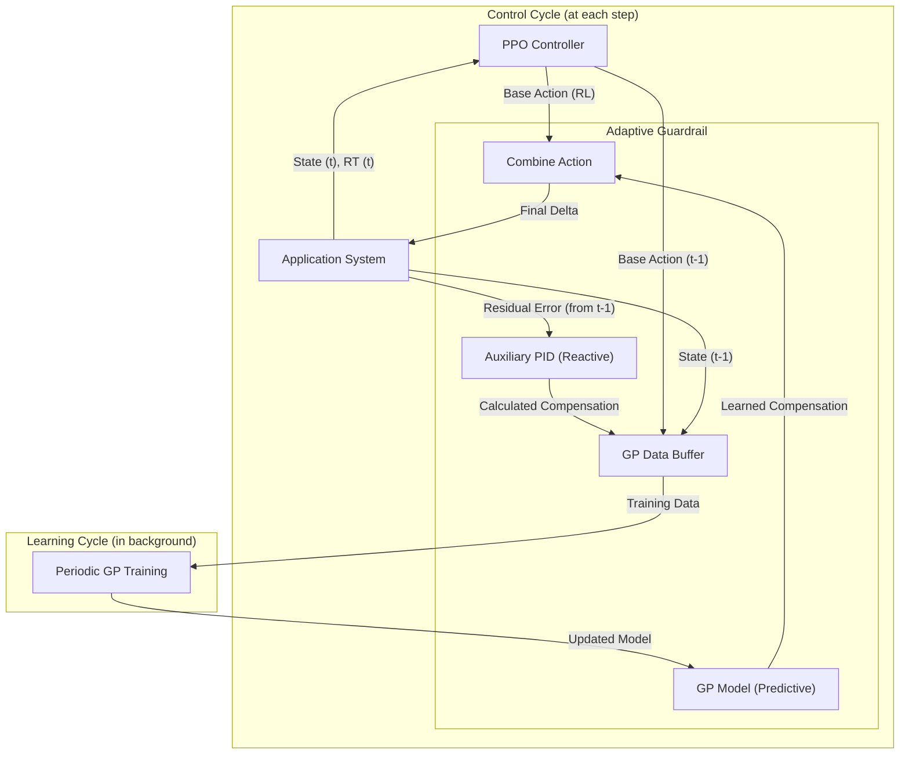

# GPPPO Controller: An Adaptive Guardrail for AI-Based Controllers

This document describes the architecture and philosophy of the `GPPPOController`, a hybrid autoscaling system designed to enhance the robustness and reliability of AI-based controllers (such as those using Reinforcement Learning) in real-world production environments.

The core idea is to augment the main AI controller (PPO) with an **adaptive guardrail**, composed of an auxiliary PID controller and a Gaussian Process (GP) model, which intervenes to correct errors and adapt to unforeseen conditions.

## Core Concepts

The architecture is based on the synergistic coupling of three components, each with a specific role:

1.  **PPO (Proximal Policy Optimization) Controller**: This is the strategic "brain" of the system. Being based on RL, its goal is to learn an optimal scaling policy to maximize a reward metric (e.g., minimizing response time while keeping costs low).
    *   **Strength**: Ability to make proactive decisions based on the system's state.
    *   **Weakness**: Can fail or be sub-optimal when faced with scenarios not seen during training (e.g., sudden load spikes, monitoring noise).

2.  **Auxiliary PID Controller**: Acts as a reactive "teacher" and a safety mechanism. Its task is **not** to control the system directly but to **correct the residual error** left by the PPO's action from the previous step.
    *   **How it works**: At time `t`, it observes the error (`RT - setpoint`) caused by the PPO's action at time `t-1` and calculates a core *compensation* that would have been necessary to nullify that error.
    *   **Key Role**: Provides high-quality, cause-and-effect training data for the Gaussian Process.

3.  **Gaussian Process (GP)**: This is the adaptive "student" of the system. Its goal is to learn the complex relationship between the system's state, the PPO's actions, and the necessary compensations calculated by the PID.
    *   **Learning**: It models the function `f(state, PPO_action) -> PID_compensation`.
    *   **Action**: Once trained, the GP replaces the PID in providing compensations, but in a predictive rather than purely reactive manner.

### Control Flow Architecture



## Advantages of the Guardrail Approach

1.  **Robustness and Safety**: The guardrail (first PID, then GP) prevents incorrect decisions from the AI controller from leading to severe SLA violations or system instability. If the PPO fails, the corrective system intervenes.

2.  **Continuous Adaptability**: The real world is not static. Workloads change, and system dynamics can vary. The periodic retraining of the GP with fresh data generated by the PID allows the guardrail to adapt to these new conditions, unlike a purely static AI model.

3.  **Better Noise Management**: Real-world monitoring systems are noisy. A pure RL controller might interpret noise as a signal, leading to incorrect scaling decisions. The PID, by acting on accumulated error, is inherently more resistant to momentary fluctuations and provides "filtered" data to the GP.

4.  **Safe Transition Phase (PID → GP)**: The system does not rely on the GP until it has collected a sufficient number of high-quality samples. In the initial phase, control is handled by the PPO + PID combination, which is simpler and more robust, ensuring acceptable performance from the start.

## Challenges and Considerations

1.  **PID Tuning is Critical**: The performance of the entire system depends on the quality of the data generated by the PID. A poorly tuned PID (e.g., with a `ki` that is too high, causing oscillations) will "poison" the GP's training data, causing it to learn an ineffective compensation policy. PID stability is a fundamental requirement.

2.  **GP Computational Overhead**: Training a Gaussian Process can be computationally intensive, especially with a large data buffer. The choice of retraining frequency (`gp_train_freq`) is a trade-off between model adaptability and CPU load.

3.  **GP Feature Engineering**: The GP's input (currently `[PPO_action, users, response_time]`) is crucial for its ability to predict the correct compensation. Tuning or adding more features (e.g., load trends) may be necessary to improve performance in complex scenarios.

4.  **Transition Parametrization**: Deciding *when* to switch from PID to GP (`gp_min_samples`, `gp_train_start`) is fundamental. A premature switch might rely on a weak GP model, while a late switch reduces the benefits of the adaptive approach.

## Configuration

This approach is implemented in the `GPPPOController` and can be configured via a `locustfile`, allowing for easy experimentation with its parameters.

```python
"controller" : {
    "class" : "GPPPOController",
    "params" : {
        "period" : 1, 
        "init_cores" : 1, 
        "min_cores" : 0.5,
        "max_cores" : 16,
        "st" : 0.8,
        "train" : False,
        "burst_mode" : "none",
        "trend_features" : False,
        "enable_log" : True,
        "log_dir" : "./logs",
        
        // Guardrail Parameters
        "kp" : 10,
        "ki" : 1,
        
        // GP Transition and Training Parameters
        "gp_train_start": 100,
        "gp_min_samples": 150,
        "gp_train_freq": 50,
        "gp_max_buffer_size": 300,
        "gp_percentile": 95
    }
} 
``` 