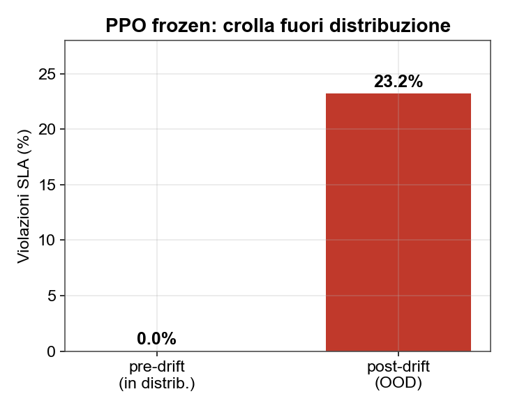
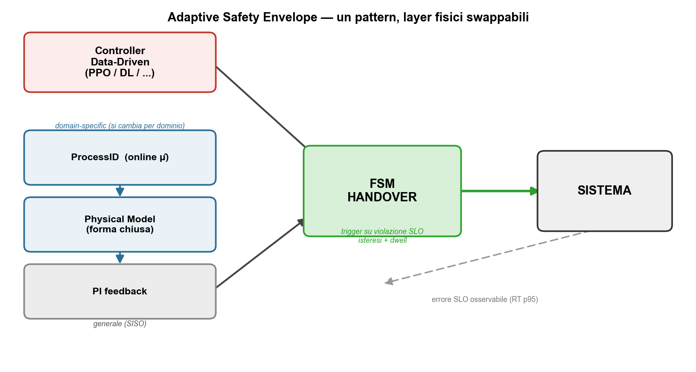
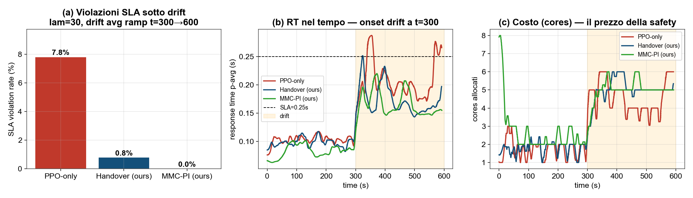
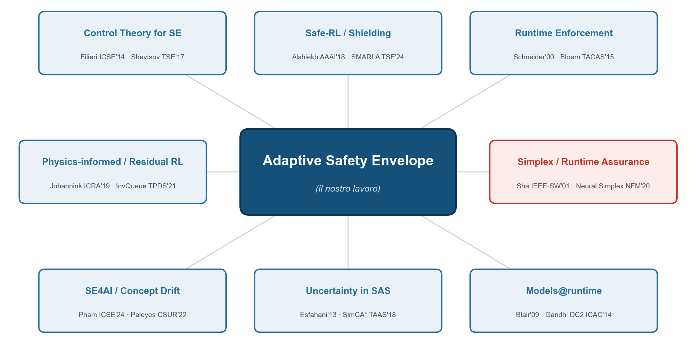

<!-- _class: lead -->

# Physics-Informed Runtime Safety per Controller Data-Driven

### Dal "GP-wrapper" all'**Adaptive Safety Envelope**

---

<!-- _class: lead -->

## L'idea in una riga

 

> Un controller **data-driven** addestrato su una distribuzione **crolla quando il sistema deriva fuori distribuzione**.
> Gli affianchiamo un **layer di sicurezza fisico** che subentra quando il sistema viola la SLA.

 

### Lo chiamiamo **Adaptive Safety Envelope** — non "safe-RL", ma un **pattern architetturale generale**

---

## Il problema è reale

**PPO addestrato su carico pulito:**

- ✅ **0%** violazioni in distribuzione
- ❌ **23%** violazioni quando il service-time cambia (drift)

 

La policy congelata **non vede** il drift e satura sotto il massimo dei core.

Questa è la motivazione dell'**Adaptive Safety Envelope**.

---

## Lo shift di paradigma

| | PRIMA · GPPPO | DOPO · Adaptive Safety Envelope |
|---|---|---|
| Guardrail | Gaussian Process | **Modello fisico + PI** |
| Cosa fa | corregge il PI (circolare) | stima μ̂ **online**, azione in forma chiusa |
| Trigger | incertezza GP (fragile) | **violazione SLA osservabile** |
| Generalità | legato a PPO | **policy-agnostic, multi-dominio** |

> Il GP era circolare, fragile *proprio sotto drift*, senza prior fisico. Il floor fisico dà una **garanzia provabile**.

---

## Adaptive Safety Envelope — il contributo

3 layer **swappabili** (domain-specific) + 2 **generali** (PI + FSM) → nuovo dominio = cambi solo le scatole fisiche.

---

## Generalità: stessa ricetta, 4 domini

| Dominio | ProcessID (μ̂) | Physical Model | PI su |
|---|---|---|---|
| **Autoscaling** | Utilization Law | M/M/c + Erlang-C | errore RT |
| **HVAC** | parametri termici RC | eq. calore 1-zona | temperatura |
| **Cruise Control** | massa + drag | dinamica longitud. | velocità |
| **Grid** | inerzia equivalente | swing equation | Δf |

> **L'Adaptive Safety Envelope non cambia.** Cambiano solo le due scatole fisiche (domain-specific) → è un *pattern*, non un sistema.

---

## I risultati locali

**Handover** e **MMC-PI** = istanze dell'**Adaptive Safety Envelope** per l'autoscaling. Scenario fair e appaiato: lam=30, drift ramp t=300→600, SLA=0.25s, stesso seed.

---

## I numeri

| Controller | Viol. SLA | RT p95 | Costo (cores) |
|---|---|---|---|
| PPO-only (nudo) | 7.8 % | 0.270 s | 3.10 |
| **HandoverPPO** (PPO + safety) | **0.8 %** | 0.212 s | 3.36 |
| **MMC-PI** (solo fisica) | **0.0 %** | 0.203 s | 3.72 |

 

- L'**Adaptive Safety Envelope** azzera quasi le violazioni con **+8–20% di costo**
- La fisica da sola è già al sicuro → è lei il motore della safety

---

## Stato — onesto

| ✅ Funziona | 🔧 Da fare per il paper |
|---|---|
| Tesi: data-driven crolla, fisica recupera | Multi-seed (oggi seed singolo) |
| Floor M/M/c → garanzia provabile | Ablation formale a 4 vie |
| FSM handover stabile (isteresi) | Risultati AWS del nuovo sistema |
|  | 2° dominio |

> Limite onesto: a drift severo nessuno recupera (saturazione) → è un *envelope di recuperabilità*.

---

<!-- _class: lead -->

## Discussione

**1. Quale 2° dominio?** → HVAC (simulatori pronti) vs Cruise Control (più "AV")

**2. Garanzia da rivendicare?** → deterministica (floor M/M/c) vs probabilistica

**3. Posizionamento?** → venue SE (SEAMS/ICSE) vs systems (NSDI/ATC)

**4. Attacco reviewer** → "reattivo, non predittivo": il trigger osservabile è *più affidabile* di una stima d'incertezza

---

<!-- _class: lead -->

# Posizionamento nella letteratura

dove ci collochiamo · radici teoriche · lavori più vicini

---

## Dove si colloca

Intersezione di più comunità SE — la radice teorica (in **rosso**) è la *Simplex architecture* del controllo.

---

<!-- _class: tight -->

## Radici nella teoria del controllo

| Nostro componente | Concetto di controllo | Riferimento seminale |
|---|---|---|
| RL + controller sicuro + switch | **Simplex Architecture** | Sha, *IEEE Software* 2001 |
| Safety ctrl = online ID + M/M/c | **Self-Tuning Regulator** (adattivo) | Åström & Wittenmark |
| FSM con isteresi + dwell | **Supervisory switched control** / dwell-time | Liberzon 2003 · Hespanha–Morse 1999 |
| Transizione senza salti | **Bumpless transfer** + anti-windup | Åström & Hägglund |
| (cugino continuo) | **Safety filter / Control Barrier Function** | Ames TAC 2017 · Wabersich–Zeilinger 2021 |

> È una **Simplex architecture data-driven** — ma il controller sicuro è **adattivo** (costruito online), non fisso/pre-certificato. Questo è il delta control-theory.

---

<!-- _class: tight -->

## I filoni SE a cui ci agganciamo

| Filone | Ancora | Il nostro aggancio / gap |
|---|---|---|
| **Control Theory for SE** | Filieri ICSE'14 · Shevtsov TSE'17 | casa naturale; lì il controller *è* il PI — noi: PI come **guardrail di un RL** |
| **Safe-RL / Shielding** | Alshiekh AAAI'18 · SMARLA TSE'24 | shield **physics-based**, non da automa formale |
| **Models@runtime** | Blair'09 · Gandhi DC2 ICAC'14 | modello fisico **vivo** via online process-ID |
| **SE4AI / Concept Drift** | Pham ICSE'24 · Paleyes CSUR'22 | da *detect-then-retrain* a **mitigation runtime** |

---

<!-- _class: tight -->

## Lavori più vicini → il nostro delta

| Lavoro vicino | Cosa fa | Cosa abbiamo in più |
|---|---|---|
| **Neural Simplex** (NFM'20) | RL + safe baseline + switch | baseline **costruito online** (ID+M/M/c), non pre-certificato |
| **SafeSlice** (2025) | RL + override SLA-aware (slicing) | dominio **autoscaling** + modello fisico, non filtro di costo |
| **Gandhi DC2** (ICAC'14) | queueing+Kalman per autoscaling | è **guardrail di un RL**, non controller standalone |
| **Sinha–Pavone** (CDC'23) | OOD monitor → fallback MPC | anchor **PI leggero**, framing SE/drift |

> Novelty **media → forte se riposizionata**: non "switch RL→safe" (è Simplex), ma "**safety controller adattivo physics-informed** costruito a runtime, dove non esiste un baseline pre-verificato".

---

## Come ci vendiamo + venue

**Claim (1 frase):** l'**Adaptive Safety Envelope** è una *Simplex architecture* in cui il controller ad alta affidabilità non è fisso ma un **self-tuning regulator** guidato da identificazione online + modello **M/M/c in forma chiusa**; handover via **supervisore a isteresi/dwell**.

 

- **Venue casa**: SEAMS (self-adaptive + assurance) → poi **ICSE / FSE / TSE**
- **Framing**: self-adaptive systems, *non* safe-RL
- **Da blindare**: ricerca mirata "Simplex + autoscaling" (punto cieco); differenziare da SafeSlice e Neural Simplex
